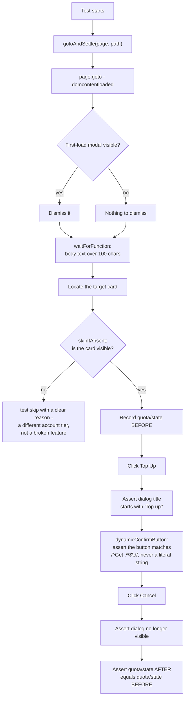

# Playwright Billing QA Suite (Sanitized Reference Implementation)

[](https://github.com/daud-khan-qa/playwright-billing-qa-suite/actions/workflows/ci.yml)
[](https://playwright.dev)

**All rights reserved.** This repository is shared publicly for portfolio and demonstration purposes only. No license is granted to copy, modify, or redistribute this code without my permission.

A production-grade Playwright E2E test suite pattern for SaaS billing systems - subscriptions, top-ups, invoices, plan upgrades/downgrades, and Stripe checkout flows.

This is a generalized, sanitized version of a suite I built and maintain for a real production billing platform (47 tests, 44/47 passing, ~17 min end-to-end runtime). All endpoints, credentials, and business-specific text below are replaced with generic placeholders - the structure and patterns are what's real.

## Why this suite is designed the way it is

### 1. Auth without fighting the login form
Billing flows are gated behind login + often reCAPTCHA. Rather than automate a brittle login UI, `utils/global-setup.js` injects a JWT directly into `localStorage` before any test runs, and every test reuses that saved `storageState`. One login, zero flaky auth steps, and the whole suite runs against a real authenticated session.

### 2. "Sabotage-verify" every assertion
The single most common failure mode in E2E billing tests isn't a missing feature - it's a **false green**: a test that passes even when the thing it claims to check is broken. Common traps this suite is built to avoid:
- Asserting on text a `.first()` locator picked up from unrelated nav/sidebar content instead of the actual page body
- Clicking a confirm button whose label is **dynamic** (e.g., "Get 2 Seats for $70") using a literal string match that only works for quantity = 1
- Asserting a page loaded correctly before checking whether it hydrated at all
- Trusting a cached list value that renders before the real detail-fetch resolves

Every assertion in this suite is written to fail loudly if the underlying UI text is wrong - not just if the element is missing.

### 3. Soft-checks for third-party flows
Stripe checkout pages are outside the application under test and can change without notice. The suite uses annotated soft-checks (`test.info().annotations.push(...)`) for Stripe-dependent steps so a third-party UI change surfaces as a flagged annotation, not a hard suite failure that blocks unrelated work.

### 4. Skip-guards, not hard failures, for missing UI
If a top-up card or plan control isn't present on a given account/plan tier, the test skips with a clear reason rather than failing - a genuinely different account state is not the same thing as a broken feature.

## What one test actually does, step by step

Traced directly against `utils/billing-helpers.js` and the "cancels without charging" test in `tests/topup.spec.js` - every box below is a real call in the code, in call order.



Step `L` is the actual sabotage-verify moment: most billing tests would stop at "the dialog closed," which passes even if Cancel silently charged the card anyway. This test doesn't count Cancel as proven safe until it re-checks the account state and confirms nothing changed.

## Key patterns (from `utils/billing-helpers.js`)

- `gotoAndSettle()` - navigates, dismisses any first-load modal, waits for the SPA to finish rendering before returning control to the test
- Explicit `skipIfAbsent(locator, reason)` helper instead of letting a missing element throw a raw timeout
- Every dynamic-label button matched with `startsWith` + content checks (e.g. starts with `"Get "` and contains `"$"`) instead of a literal string

## Example test (sanitized)

```js
test('top-up card completes purchase and updates quota', async ({ page }) => {
  await gotoAndSettle(page, '/billing?tab=plans-topups');

  const card = page.locator('[data-card="demo-credits"]');
  if (!(await card.isVisible())) test.skip(true, 'card not present on this account tier');

  await card.getByRole('button', { name: 'Top Up' }).click();
  await expect(page.getByRole('dialog')).toContainText('Top up:');

  const confirmBtn = page.getByRole('button', { name: /^Get .*\$/ });
  await confirmBtn.click();

  await page.waitForURL(/checkout\.stripe\.com/);
  // soft-check: third-party page, don't hard-fail the whole suite on it
  test.info().annotations.push({ type: 'external', description: 'Stripe checkout reached' });
});
```

## Structure

```
tests/
  topup.spec.js           Top-up purchase flow: card selection, quantity edge case,
                          dynamic confirm-button label, cancel-without-charging
  plans.spec.js           Plan upgrade/downgrade: pricing table, billing-frequency
                          toggle, confirmation modal
utils/
  billing-helpers.js       gotoAndSettle() page-load helper + shared assertions
playwright.config.js       workers:1 (sequential against a shared test account),
                          90s test / 45s navigation / 8s action timeouts
```

## Real-world results (sanitized)

- 47 tests, 44 passing, 0 hard failures, 3 intentionally skipped (auth UI tests made irrelevant by JWT injection) - ~17 minute full run
- Applied the sabotage-verify discipline above to audit an existing 20-test billing regression suite and found the majority of its tests were asserting against UI that no longer existed or asserting the wrong data entirely - rewrote the full suite with live-verified assertions before it could ship a false "all green" signal to release sign-off

## Relationship to my other repos

- [`agentic-safety-patterns`](https://github.com/daud-khan-qa/agentic-safety-patterns) - the AI-agent safety-engineering side of the work
- [`e2e-test-suite-patterns`](https://github.com/daud-khan-qa/e2e-test-suite-patterns) - the same sabotage-verify discipline applied to route-gating and onboarding flows, with a runnable fixture server

---
Sanitized reference implementation - endpoints, account details, and business-specific copy are placeholders. Structure and patterns reflect real production QA work.
